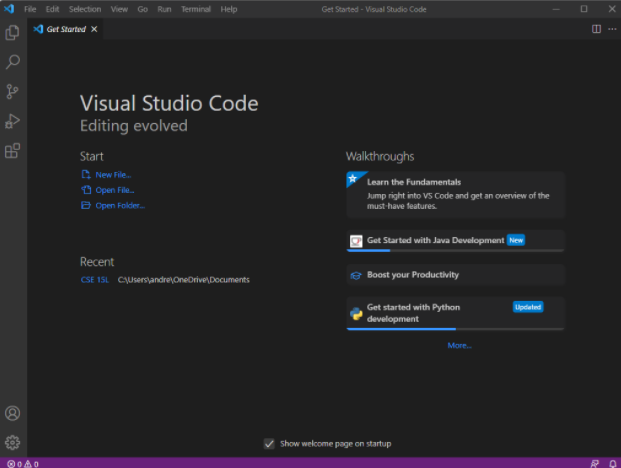
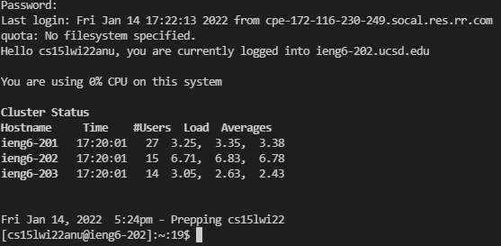
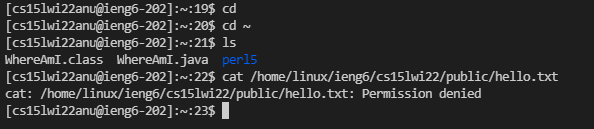
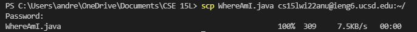
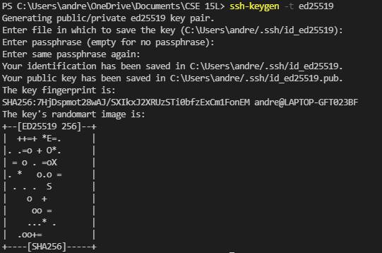
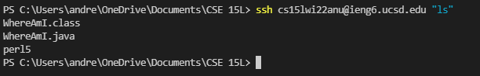

# Lab Report 1

## Installing VSCode

* Download from the following [link]("https://code.visualstudio.com/download")
* Make sure to get the right version for your operating system

## Remotely Connecting

* Using the ssh (secure shell) command
* ssh cs15lwi22zzz@ieng6.ucsd.edu
* where zzz is replaced by your accound info

## Trying Some Commands

* Try running cd, ls, pwd, mkdir, and cp
* exit can be used to log out

## Moving Files with scp

* Using scp (Secure CoPy)
* Make sure that WhereAmI.java (or whatever file you want) exists on your computer first

## Setting an SSH Key

* Generate a ssh key pair to avoid having to type in your password every time
* ssh-keygen generates the keys
* ssh-add for Windows users [here](https://docs.microsoft.com/en-us/windows-server/administration/openssh/openssh_keymanagement#user-key-generation)
* Login and run mkdir .ssh to create a .ssh folder on the server, then logout
* scp (location of public key on local computer) cs15lwi22zzz@ieng6.ucsd.edu:~/.ssh/authorized_keys to add public key to server

## Optimizing Remote Running

* Commands in quotes after ssh will run the commands, then exit
* Semicolons can be used to run multiple commands on the same line
* cp WhereAmI.java OtherMain.java; javac OtherMain.java; java WhereAmI
* Previous method: "ssh cs15lwi22zzz@ieng6.ucsd.edu", "PASSWORD", ls (total of 35+ keystrokes)
* New method: copy "ssh cs15lwi22zzz@ieng6.ucsd.edu" (Alt+Tab, Ctl+c-v), type "ls" (total of 10 keystrokes)
* By more than halving the number of keystrokes, remotely running code is more than twice as fast as it was previouslly

## Conclusion
Congrats on making it to the end!  
Here's an orange:
