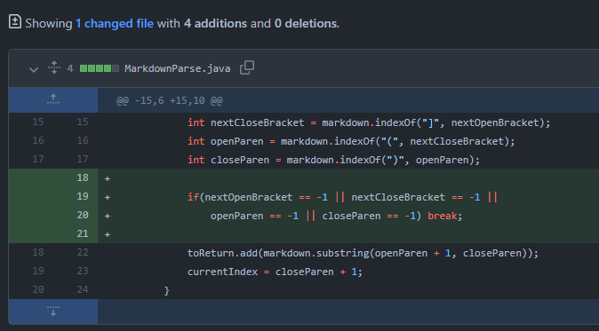
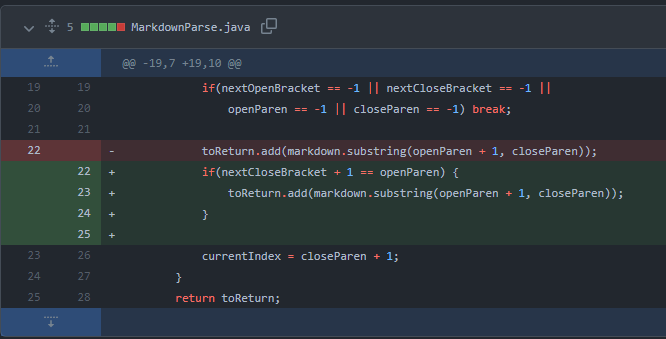
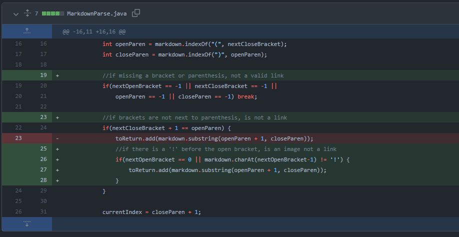

# Lab Report 2

## Code Change 1

* [Link to test file](https://github.com/AndrewJia/markdown-parse/blob/main/test-file2.md)
* Symptom: Exception in thread "main" java.lang.OutOfMemoryError: Java heap space
* The symptom was an infinite loop causing an out of memory error. The symptom was caused by a bug that set current index to -1 when there were no more close parenthesis in the failure-inducing input. 

## Code Change 2

* [Link to test file](https://github.com/AndrewJia/markdown-parse/blob/main/test-file5.md)
* Symptom: A string in parenthesis would be added to the output even though the brackets are not touching the parenthesis (not following markdown format for link).
* The bug was the fact that the indices of the close bracket and open parenthesis were not compared to each other, because the index of the open parenthesis should be the index of the close bracket plus one. Any file with text or spaces between the brackets and parenthesis is a failure-inducing input for this bug. 

## Code Change 3

* [Link to test file](https://github.com/AndrewJia/markdown-parse/blob/main/test-file6.md)
* Symptom: The url of an image would be mistakenly added to output. 
* The bug was the program not checking if a bracket-parenthesis pair was part of an image or a link. Because of this, the symptom caused was the url of every image being added to the output. Any file with an image is a failure-inducing input for this bug.