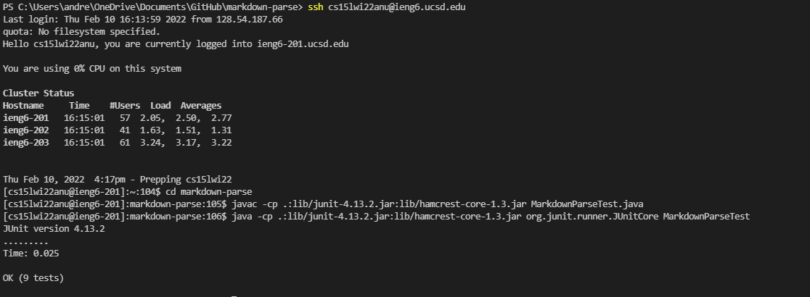
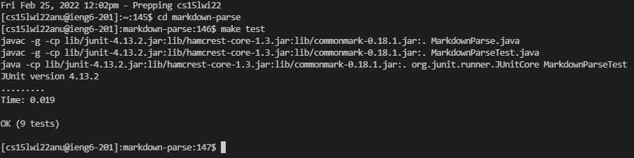
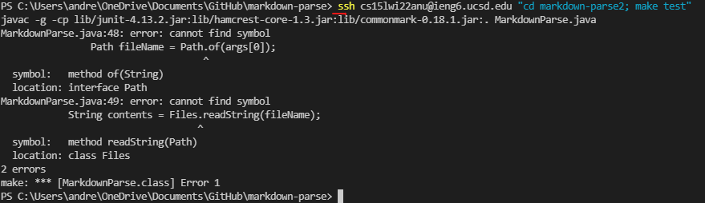

# Lab Report 3

## Copy whole directories with scp -r

* scp -r . cs15lwi22zzz@ieng6.ucsd.edu:~/markdown-parse
* copies the current directory to the server
* The ~/markdown-parse tells the server to create a markdown-parse directory if it doesn't exist already

* after logging in to ieng6

* compiling and running the tests
* make sure to use the Linux commands

## Commands typed line by line work

using javac, java  
 

using make test
 

## Commands typed on one line do not work

* I have been told this cannot find symbol error is a windows/java error

