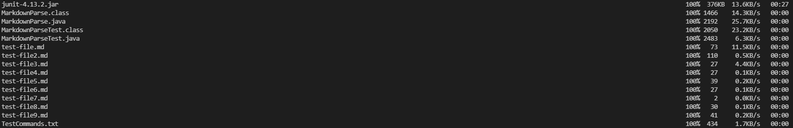
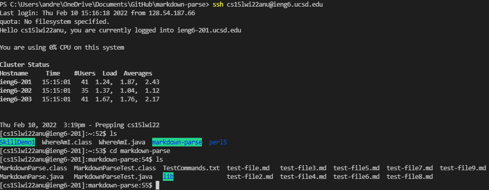
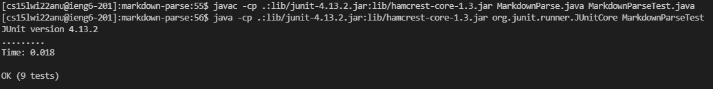

# Lab Report 3

## Copy whole directories with scp -r

* scp -r . cs15lwi22zzz@ieng6.ucsd.edu:~/markdown-parse
* copies the current directory to the server
* The ~/markdown-parse tells the server to create a markdown-parse directory if it doesn't exist already

* after logging in to ieng6

* compiling and running the tests
* make sure to use the Linux commands

## Yeah I gave up here
* best attempts:
* ssh cs15lwi22anu@ieng6.ucsd.edu "cd markdown-parse javac -cp .:lib/junit-4.13.2.jar:lib/hamcrest-core-1.3.jar MarkdownParseTest.java javac -cp .:lib/junit-4.13.2.jar:lib/hamcrest-core-1.3.jar MarkdownParse.java java -cp .:lib/junit-4.13.2.jar:lib/hamcrest-core-1.3.jar org.junit.runner.JUnitCore MarkdownParseTest"
* ssh cs15lwi22anu@ieng6.ucsd.edu "cd markdown-parse; make Test"