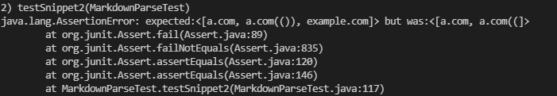
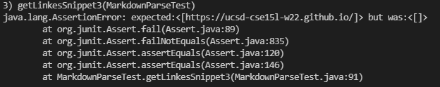

# Lab Report 4

* my repo: https://github.com/AndrewJia/markdown-parse
* reviwed repo: https://github.com/xis004/markdown-parse

## Snippet 1

* intended output: ["`google.com", "google.com", "ucsd.edu"]

 
My result - failed

Reviewed result - failed

How to fix
* My understanding of `s: brackets or parenthesis within two of them do not count toward formatting
* I think the fix could be done within 10 lines, but it migh take me ~20
* After finding a local variable (nextOpenBracket, nextCloseBracket, openParen, closeParen), check if it is between the first and second `, or third and fourth, etc. If it is, recalculate the bracket/parenthesis 

## Snippet 2

* intended output: ["a.com", "a.com(())", "example.com"]

 
My result - failed

Reviewed result - failed

How to fix
* I don't think this can be done within 10 lines.
* From my understanding, I don't fully understand how nested brackets work, so I'm just assuming this is complicated enough that it takes more than 10 lines.
* In addition, we check if there is a \ in front of a bracket. If there is, we have to ignore it

## Snippet 3

* intended output: ["https://ucsd-cse15l-w22.github.io/"]

 
My result - failed

Reviewed result - failed

How to fix
* I think this can be done within 10 lines.
* From my understanding, line breaks are allowed within the brackets as long as there aren't two in a row. Line breaks are allowed before and after the url, as long as there aren't two in a row.
* String trim should be able to trim off the line breaks from the input string (the string between the openParen and closeParen)
* One way to check the brackets is to simply do a for loop, iterating on each character. If it is a line break and the next character is a line break, the link is invalid.