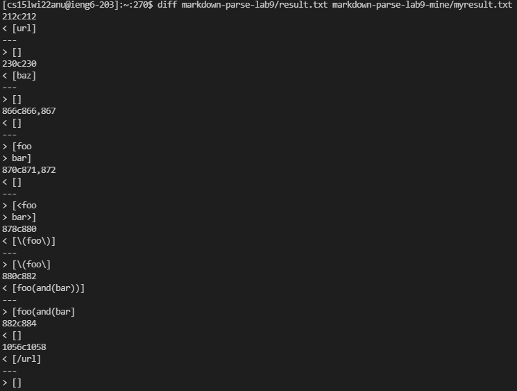

# Lab Report 5

## Comparing Results
* Using diff


## Different Result 1
Test file 194

Contents of file
```
[Foo*bar\]]:my_(url) 'title (with parens)'

[Foo*bar\]]
```
Expected
> my_(url)

Provided result
> [url]

My Result 
> []

Conclusion
* Neither implementation is correct
* Bug (with my implementation): does not recognize the format of [tag]:url [tag]

## Different Result 2
Test file 201

Contents of file
```
[foo]: <bar>(baz)

[foo]
```
Expected
> []

Provided result
> [baz]

My Result 
> []

Conclusion
* My implementation is correct
* Bug (with provided implementation): does not check if there are extra characters between the close bracket and open parenthesis other than special characters